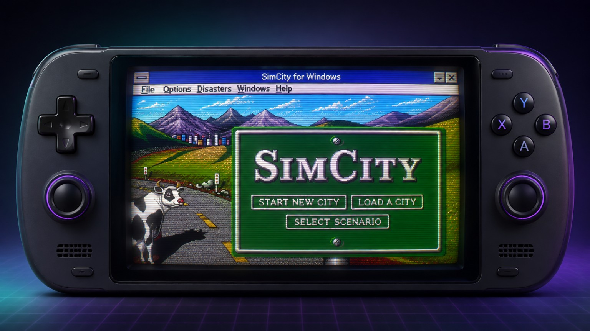
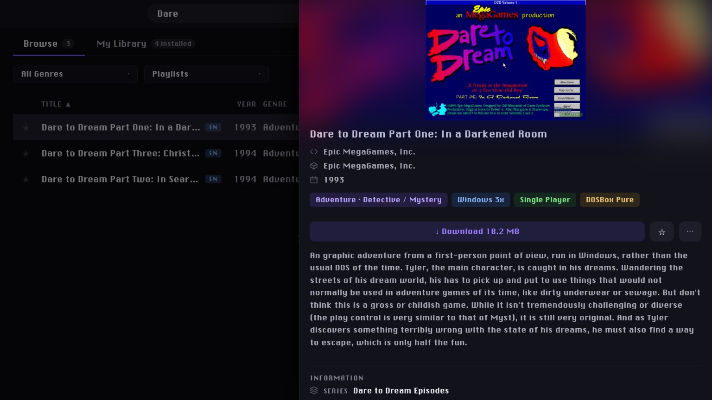

# ExoWin Pocket

<p align="center">
  
</p>

ExoWin Pocket is an unofficial Android fork of [Exodium Pocket](https://github.com/androidgyny/exodium-pocket), itself based on [Thomas Vollstaedt's Exodium](https://github.com/tvollstaedt/exodium). It provides a handheld-friendly browser and selective downloader for a curated subset of the eXoWin3x collection.

Downloaded games launch through a separately installed RetroArch app with the DOSBox Pure core and a Windows 3.1 shell image supplied by the user.

## Project Expectations

ExoWin Pocket is a vibe-coded personal project, built with ChatGPT/Codex for one Android handheld and published in case it is useful to somebody else. It should be treated as an experimental personal fork, not a supported product.

There is no guarantee that it will install, download, launch, or behave correctly on another device. There is also no guarantee of support, releases, fixes, documentation updates, compatibility, or future development. Expect sharp edges and keep backups of anything important.

## Screenshot

<p align="center">
  
</p>

## Status

ExoWin Pocket is an MVP Android launcher for Windows 3.x games. It keeps Exodium's catalog, torrent download flow, library UI, artwork packs, metadata packs, favorites, and installed-game tracking, while adding Android storage handling and a native bridge that asks RetroArch to launch a downloaded game ZIP.

At launch time, ExoWin Pocket interprets the original eXoWin3x DOSBox configuration, creates a DOSBox Pure save overlay, mounts the user's shared Windows shell, and prepares the per-game Windows files and startup command. The curated catalog contains 1,119 candidates after 19 recipes with known blockers were excluded.

Manuals supplied by the optional extended metadata pack are also supported. Text, HTML, and image manuals can be viewed inside ExoWin Pocket; on Android, PDF, Word, and RTF manuals are passed to a compatible installed document reader.

## Limitations

- The Android MVP is for the curated eXoWin3x catalog. It is not an eXoDOS, eXoWin9x, Windows 95, or Windows 98 launcher.
- Compatibility is incomplete. The original collection was built around multiple desktop DOSBox variants and per-game settings; ExoWin Pocket instead routes everything through DOSBox Pure on Android.
- Only a small portion of the catalog has been tested by hand. A successful download does not imply that a game will boot, render, play sound, accept input, or remain stable.
- Some games require the user to adjust DOSBox Pure core options such as memory, CPU type, core mode, or cycles. ExoWin Pocket does not create or modify RetroArch's per-game `.opt` files; configure and save those options from RetroArch's Quick Menu.
- Manuals require the optional extended metadata pack. PDF, Word, and RTF manuals also require a compatible document reader installed on Android.
- CD, floppy, multi-disc, Win32s, installer-driven, unusual drive-letter, and hybrid DOS/Windows titles are more likely to fail.
- Nineteen known-incompatible or unsupported launch recipes are omitted from the catalog. See [Compatibility Notes](docs/COMPATIBILITY.md).
- Importing an existing desktop eXo installation is not a supported workflow. ExoWin Pocket is designed to manage its own Android download folder.

Passing a varied smoke-test set is evidence that the launch translation works for those recipe families, not proof of universal compatibility.

## External Requirements

ExoWin Pocket does not bundle an emulator, games, Windows, ROMs, drivers, or media packs.

Install and configure these separately before launching a game:

- RetroArch for Android from the [RetroArch platforms page](https://www.retroarch.com/?page=platforms). The default configuration recognizes both `com.retroarch` and `com.retroarch.aarch64`.
- The DOSBox Pure libretro core inside RetroArch.
- A legally obtained Windows 3.1 or Windows for Workgroups 3.11 installation assembled as `Windows311-EXOWIN.dosz`.

A separate PDF or document reader is optional and is needed only to open manual formats that Android's WebView cannot display directly.

The Windows shell is essential. Follow the complete [Windows DOSZ Assembly Guide](docs/WINDOWS-DOSZ.md); a generic Windows archive is unlikely to have the layout, drivers, mouse support, and exit helper expected by the launcher.

## Android Storage Requirement

ExoWin Pocket requires Android "All files access" to manage its shared-storage library and prepare DOSBox Pure save overlays. RetroArch separately needs access to the same ordinary shared-storage paths. The current port does not use a fully scoped-storage or Storage Access Framework workflow.

By default, the app stores its library under `/storage/emulated/0/ExoWinPocket`, expects the Windows shell at `/storage/emulated/0/RetroArch/system/Windows311-EXOWIN.dosz`, and writes DOSBox Pure save overlays containing translated startup files under `/storage/emulated/0/RetroArch/saves/DOSBox-pure`.

ExoWin Pocket does not read or modify RetroArch's private configuration under `Android/data`, and it does not manage RetroArch's per-game core-option files.

After installing the APK, grant ExoWin Pocket "All files access" in Android settings. Without it, setup, downloads, artwork installation, disk-space checks, shell validation, or launching can fail even when ordinary media permissions appear enabled.

## What Is Included

- Android-specific Tauri configuration for package `app.exowinpocket`.
- Native bridges for Android storage permission, external document viewing, and RetroArch launching.
- Curated eXoWin3x catalog metadata, launch configurations, and torrent metadata.
- Selective game downloads, optional artwork/metadata packs, favorites, installation tracking, and uninstall support.
- Launch translation for ordinary Windows-folder recipes and many `WIN`, batch, CD image, floppy image, multi-disc, and arbitrary-drive recipes.
- A locally patched `librqbit` 9.0.1 source tree used by this release.
- The upstream MIT license and attribution.

## What Is Not Included

- Windows, Windows installation media, license keys, Windows drivers, or `Windows311-EXOWIN.dosz`.
- `RUNEXIT.EXE` or any other proprietary or third-party Windows helper executable.
- RetroArch, DOSBox Pure, emulator cores, BIOS/ROM images, or soundfont/MT-32 ROM files.
- Downloaded games, manuals, screenshots, videos, box art, metadata packs, or other eXo content.
- Generated Android project files, APKs in Git history, or native build output. APKs are attached separately to GitHub Releases.

## Development

Prerequisites:

- pnpm
- Rust toolchain
- Android SDK/NDK configured for Tauri Android builds
- RetroArch and DOSBox Pure on a target Android device for launch testing

Install dependencies and run checks:

```bash
pnpm install
pnpm test
pnpm run typecheck
cargo test --manifest-path src-tauri/Cargo.toml
```

Build a local arm64 APK:

```bash
pnpm android:init
pnpm android:build:apk
```

The generated Android project under `src-tauri/gen/android` is intentionally ignored. The build script patches its manifest to request the broad storage access used by the current filesystem-based workflow.

## Upstream

ExoWin Pocket is not affiliated with or endorsed by Exodium, Exodium Pocket, RetroArch, libretro, DOSBox Pure, DOSBox, Microsoft, eXoWin3x, or the eXo project.

Upstream Exodium is available at [tvollstaedt/exodium](https://github.com/tvollstaedt/exodium), and the Android DOS-focused sister project is [androidgyny/exodium-pocket](https://github.com/androidgyny/exodium-pocket). Please direct ExoWin Pocket issues only to [androidgyny/exowin-pocket](https://github.com/androidgyny/exowin-pocket).

## Legal

The application code is MIT licensed. See [LICENSE](LICENSE), [NOTICE.md](NOTICE.md), and [THIRD_PARTY_NOTICES.md](THIRD_PARTY_NOTICES.md).

This repository and its releases do not grant rights to download, install, distribute, or play third-party games, Windows, drivers, media, or other content. Users are responsible for supplying properly licensed software and for complying with all applicable laws and licenses.
